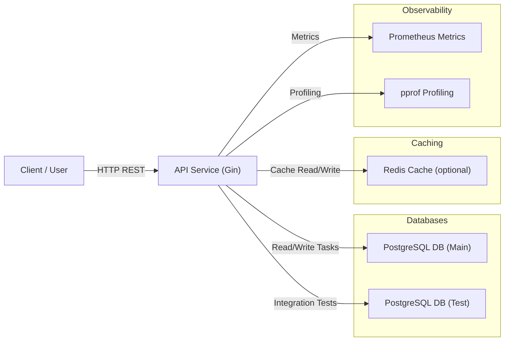

# Go Task Manager API
Go Task Manager API is a simple task management service built with Go, Gin, and PostgreSQL. It provides CRUD operations for tasks, including creation, listing, updating, fetching by ID, and deletion. The API also supports optional caching with Redis and observability via Prometheus metrics.


- **Purpose:** Manage tasks for internal team or applications.
- **Technologies:** Go, Gin, PostgreSQL, Redis, Prometheus, Docker.
- **Features:**
- Create, read, update, delete tasks.
- Pagination and filtering on task listing.
- Optional caching layer for task lists (Redis).
- API documentation via Swagger.
- Benchmarking and profiling support.
---
## Setup / Environment

### Requirements
- Go 1.21+
- Docker & Docker Compose
- PostgreSQL (optional if using Docker)
- Redis (optional if using cache layer)


### Architecture



### Environment Variables
The project includes a `.env.example` file with all necessary configuration keys.
To run the project, create a copy named `.env` in the root directory and set appropriate values for your environment:

```bash
  cp .env.example .env
```
Then edit .env with your preferred editor
Main variables include:

**Application**
- `ENV` - Environment (production, development, test)
- `PORT` - Application port
- `HOST_BASE_PATH` - Host address for Swagger and API calls

**Database Configuration**
The project uses **two separate PostgreSQL databases**: one for regular usage and one for running integration tests.

**Main Database (for normal operation)**  
These variables configure the primary database used by the API:

- `DB_TYPE` - Database type (e.g., `postgres`)
- `DB_HOST` - Hostname of the database container or server (`db`)
- `DB_PORT` - Database port (`5432`)
- `DB_USER` - Username for database authentication (`myuser`)
- `DB_PASSWORD` - Password for the database user (`mypass`)
- `DB_NAME` - Name of the main database (`mydb`)
- `DB_SSLMODE` - SSL mode (usually `disable` for local development)

**Test Database (for integration tests)**  
These variables configure a separate test database to safely run automated integration tests without affecting production data:

- `TEST_DB_HOST` - Hostname of the test database container (`db_test`)
- `TEST_DB_PORT` - Port of the test database (`6433`)
- `TEST_DB_USER` - Username for the test database (`test_user`)
- `TEST_DB_PASSWORD` - Password for the test database user (`test_pass`)
- `TEST_DB_NAME` - Name of the test database (`test_db`)
- `TEST_DB_SSLMODE` - SSL mode (usually `disable`)

**Notes:**
- Both databases are expected to run in Docker containers defined in `docker-compose.yml`.
- The test database allows running integration tests safely without touching the main database.
- Make sure the test database container is running before executing integration tests.

**Redis (optional)**
- `REDIS_HOST`,
- `REDIS_PORT`,
- `REDIS_PASSWORD`, 
- `REDIS_TTL`

---
### Docker Setup

Start all services in the background:

**Build images and start all services:**
```bash 
  make docker-up
```
**Rebuild and restart services:**
```bash 
  make restart
```
**Stop and remove all services:**
```bash 
  make docker-down
```

**docker Setup for Databases:**

- Start main database:
``` bash
    make db-up
    make db-migrate-up
```
- Start test database:
``` bash
    make db-test-up
    make db-test-migrate-up
```
---
### HTTP / REST Endpoints

The project exposes a RESTful API built with Gin. All routes are prefixed with /api.

**Main endpoints include:**

| Method   | Endpoint         | Description                                        |
|----------|------------------|----------------------------------------------------|
| GET      | `/api/tasks`     | List all tasks (supports pagination and filtering) |
| POST     | `/api/tasks`     | Create a new task                                  |
| GET      | `/api/tasks/:id` | Get a single task by ID                            |
| PUT      | `/api/tasks/:id` | Update a task by ID                                |
| DELETE   | `/api/tasks/:id` | Delete a task by ID                                |


**Query parameters for GET /api/tasks:**

| Parameter   | Type    | Description                                     | Default  |
|-------------|---------|-------------------------------------------------|----------|
| `page`      | int     | Page number                                     | 1        |
| `per_page`  | int     | Number of tasks per page                        | 20       |
| `filter`    | string  | Filter tasks by any field (e.g., title, status) | -        |

---

### Swagger / OpenAPI

The API is fully documented using Swagger. You can access the ***Swagger*** UI locally after running the project:

```terminal
    http://localhost:8080/swagger/index.html
```

The OpenAPI specification is generated from code annotations using ***swaggo/swag***.

Example response for `GET /api/tasks`:
``` json
{
  "data": [
    {
      "id": 1,
      "title": "Sample task",
      "description": "This is a sample",
      "status": "pending",
      "assigneeID": 0,
      "createdAt": "2025-12-05T12:00:00Z",
      "updatedAt": "2025-12-05T12:00:00Z"
    }
  ],
  "meta": {
    "page": 1,
    "per_page": 20,
    "total": 1,
    "total_pages": 1
  },
  "message": "success",
  "errors": [],
  "status": "ok"
}

```

### Profiling & Performance Monitoring

The application exposes a ***pprof*** endpoint via Gin for profiling CPU, memory, and goroutines. This is useful for load testing and identifying bottlenecks.

- **Endpoint:** /debug/pprof/

- **Access:** Via HTTP requests while the application is running.

- **Available profiles:**
- heap – memory allocations
- goroutine – current goroutines
- threadcreate – OS thread creation
- block – blocking on synchronization
- profile – CPU profile (use go tool pprof)
- Others: allocs, mutex, cmdline, symbol, trace
    
**Example usage:**

```bash
  # Get CPU profile for 30s
  go tool pprof http://localhost:8080/debug/pprof/profile?seconds=30

  # Start interactive pprof shell
  (pprof) top
  (pprof) list FunctionName
```
**Note: This endpoint is mainly for development and testing purposes. It should not be exposed in production without proper access control.**

---
### Benchmarks & Profiling

The project includes benchmark tests for critical service methods, and supports CPU and memory profiling via pprof.

**Run Benchmarks**
```bash 
  # Run all benchmarks
  make benchmarks

  # Run CPU profiling and save to cpu.prof
  make benchmark-cpu

  # Run Heap (memory) profiling and save to heap.prof
  make benchmark-heap
```

- **CPU Profile:** Shows how much CPU time each function consumes.

- **Heap Profile:** Shows memory allocations and usage.


#### Using pprof

After generating a profile (cpu.prof or heap.prof), you can analyze it interactively:
```bash
    # Start interactive pprof shell
    go tool pprof docs/profiling/cpu.prof
    go tool pprof docs/profiling/heap.prof
    
    # Useful commands inside pprof shell:
    (pprof) top          # Show top functions consuming CPU/memory
    (pprof) list Func    # Show annotated source code of a function
    (pprof) web          # Generate an SVG graph (requires graphviz)
    (pprof) png          # Generate a PNG graph
    (pprof) pdf          # Generate a PDF graph
```


**Example Output**

Benchmark results look like this:

``` go
    BenchmarkCreateTask-8    1695  673253 ns/op  2266 B/op  47 allocs/op
    BenchmarkUpdateTask-8    1753  740585 ns/op  2200 B/op  48 allocs/op
    BenchmarkDeleteTask-8    812   1391668 ns/op 2626 B/op  59 allocs/op
    BenchmarkGetTaskByID-8   2023  682887 ns/op  1952 B/op  42 allocs/op
    BenchmarkListTasks-8     1108  1183227 ns/op 2378 B/op  49 allocs/op
```

** ⚠️ Note: Make sure the relevant test database is up and migrations are applied before running benchmarks, otherwise tests may fail.**

--- 
### Observability

The project exposes basic observability features: Prometheus metrics and pprof profiling for debugging and performance monitoring.

**Prometheus Metrics**

The API exposes metrics at the /metrics endpoint:

- **Authentication:** Basic Auth using METRICS_USERNAME and METRICS_PASSWORD
- **Example Metrics:**
- `tasks_count` – number of tasks
- `request_latency_histogram` – latency of HTTP requests
```env
    Environment Variables
    METRICS_PATH=/metrics
    METRICS_USERNAME=admin
    METRICS_PASSWORD=admin123
    METRICS_PORT=9090
```
You can scrape these metrics in Prometheus for monitoring.

**pprof Endpoint**

The application exposes runtime profiling via pprof for CPU, memory, and goroutines:

```go
    r.GET("/debug/pprof/*any", gin.WrapH(http.DefaultServeMux))
```

- **Profiles available:**
- `allocs` – memory allocations
- `block` – blocking on synchronization
- `goroutine` – current goroutines
- `heap` – heap memory usage
- `mutex` – contended mutexes
- `profile` – CPU profile
- `threadcreate` – thread creation stack traces
- `trace` – execution trace

You can use query parameters for additional options, e.g., ?debug=1 for text format, or ?seconds=30 for CPU profiling duration.

```bash
    # Example: download CPU profile for 30s
    curl -s "http://localhost:8080/debug/pprof/profile?seconds=30" > docs/profiling/cpu.prof
    go tool pprof docs/profiling/cpu.prof
```
    
This allows you to inspect live performance and memory behavior of the service.

---
### Testing & Running
**Run Tests**
The project provides unit tests, integration tests, and benchmarks. Make sure the test database is up if running integration tests.

```bash 
    # Run all unit tests
    make unit-tests

    # Run all integration tests
    make integration-tests
    
    # Run all tests (unit + integration)
    make all-tests
```

Tests use the .env configuration file and connect to either the main or test database depending on the target.

**Benchmarks**

To measure performance and generate pprof profiles:

```bash
    # Run all benchmarks
    make benchmarks
    
    # Generate CPU profile
    make benchmark-cpu
    
    # Generate Heap profile
    make benchmark-heap
```
This creates cpu.prof and heap.prof files which can be analyzed with:

```bash
    go tool pprof doc/profiling/cpu.prof
    go tool pprof doc/profiling/heap.prof

```
**Notes**
- Test database runs on a separate container and port, defined in .env (TEST_DB_* variables).
- Migrations use migrate/migrate Docker image.
- Ensure the database container is healthy before running migrations (db-up or db-test-up).

--- 
### Load Test / Benchmark Example

You can run a simple benchmark for the TaskService to check performance and memory usage. The example uses Go's built-in benchmarking and pprof for profiling.

```bash
    # Run CPU benchmark and generate profile
    make benchmark-cpu
    
    # Run Heap benchmark and generate profile
    make benchmark-heap
```

**This generates two files:**

- `cpu.prof` — CPU usage profile
- `heap.prof` — Memory allocation profile

You can inspect them with:
```bash
    # Analyze CPU profile
    go tool pprof doc/profiling/cpu.prof

    # Analyze Heap profile
    go tool pprof doc/profiling/heap.prof

```

Inside the interactive pprof shell, you can use commands like:

 ``` go
    top       # Show top functions consuming CPU/memory
    list F    # Show annotated source code for function F
    web       # Generate a SVG graph of profiling
 ```

**Example Benchmark Function**
```go
    func BenchmarkCreateTask(b *testing.B) {
        svc := service.MakeNewTaskService()
        b.ResetTimer()
        for i := 0; i < b.N; i++ {
            _, _ = svc.Create(context.Background(), service.RandomTask())
        }
    }
```

***This simple benchmark measures how fast tasks are created and shows memory allocations. You can extend similar benchmarks to other methods like UpdateTask, DeleteTask, GetTaskByID, etc.***

---
### Cache Invalidation Scenario (Redis)

The API supports optional caching for task listings using a cache-aside pattern with Redis. This improves performance for repeated queries while keeping data consistent after updates or deletions.

**Overview of the Flow:**

1- **Repository Layer**
- Introduce a TaskRepository that integrates:
- `PostgresRepository` – interacts with PostgreSQL
- `RedisCacheRepository` – handles caching for task lists
- The repository decides whether to fetch data from cache or database.

2- Cache-Aside Pattern
-**Read (GET /tasks):**
-Check Redis cache first for the requested task list.
-If cache hit → return cached tasks.
-If cache miss → fetch from PostgreSQL, store result in Redis with a TTL, then return.

-**Write (POST/PUT/DELETE /tasks/:id):**
-Perform the operation on PostgreSQL.
-Invalidate or update the corresponding cache entry in Redis.
-Example: After UPDATE or DELETE, remove the cached task list so the next GET /tasks fetches fresh data.

3- **Repository Integration Example**

type TaskRepository struct {
pgRepo    *PostgresRepository
cacheRepo *RedisCacheRepository
}

```go
    type TaskRepository struct {
        pgRepo    *PostgresRepository
        cacheRepo *RedisCacheRepository
    }

    func (r *TaskRepository) ListTasks(ctx context.Context, query TaskQuery) ([]Task, error) {
        // Try cache first
        cached, err := r.cacheRepo.GetTaskList(ctx, query)
        if err == nil && cached != nil {
            return cached, nil
        }

        // Fallback to Postgres
        tasks, err := r.pgRepo.ListTasks(ctx, query)
        if err != nil {
         return nil, err
        }

        // Store in cache
        _ = r.cacheRepo.SetTaskList(ctx, query, tasks, 10*time.Minute)
        return tasks, nil
    }

    func (r *TaskRepository) UpdateTask(ctx context.Context, task Task) error {
        if err := r.pgRepo.UpdateTask(ctx, task); err != nil {
         return err
        }
        // Invalidate cached task list
        _ = r.cacheRepo.InvalidateTaskList(ctx)
        return nil
    }

```
4- **Service Layer**
- Services use TaskRepository instead of interacting directly with Postgres or Redis.
- This keeps caching logic centralized in the repository layer, reducing duplication and maintaining separation of concerns.

5- **Cache TTL & Safety**
- Cached task lists are stored with a TTL to prevent stale data.
- Writes always invalidate the cache to ensure consistency.
 
**Explanation Example:**

Optional Redis Caching

Task listing can be cached using Redis to improve read performance. The system uses a ***cache-aside pattern**:

 - GET `/api/tasks` first checks Redis cache. If the data is missing, it queries PostgreSQL and caches the result.

- POST `/PUT/DELETE` operations update PostgreSQL and invalidate the cached task list.

This ensures cached task lists are always fresh after updates while providing fast reads.
